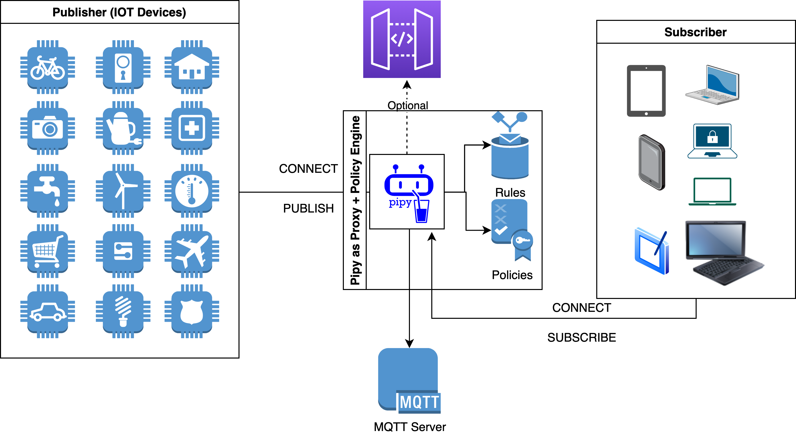

# MQTT policy enforcement with Pipy Demo

Demo code is accompanied by a Docker Compose file which configures:

* **Eclipse Mosquitto** as MQTT server
* **Pipy** proxy 

## Architecture Overview



## Running the Demo Project

First, download the [tutorial code](https://github.com/flomesh-io/pipy-demos/tree/main/pipy-mqtt-policy-engine) and initialize the components by calling Docker Compose:

```sh
$ git clone https://github.com/flomesh-io/pipy-demos.git
$ cd pipy-mqtt-policy-engine
$ sudo docker-compose up -d
```
This brings up a complete environment, including the Pipy, Eclipse Mosquitto MQTT server. Feel free to adjust the `docker-compose.yaml` or `pipy/config/policy.json` according to your specific needs.

## Testing

You can use the MQTT client of your choice which supports MQTT protocol version either 5.0 or 3.1.1 (aka 4). If you don't have any choice then you try an all-round MQTT client [MQTT Explorer](http://mqtt-explorer.com/).